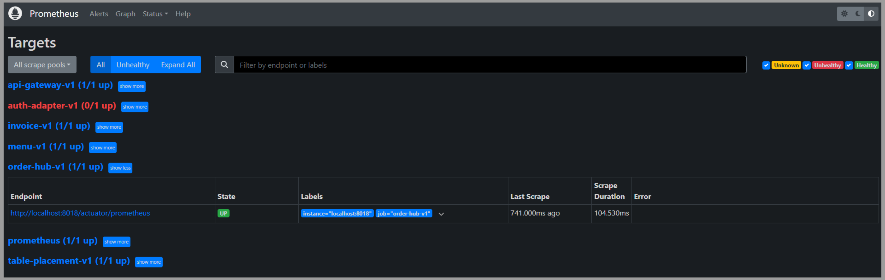
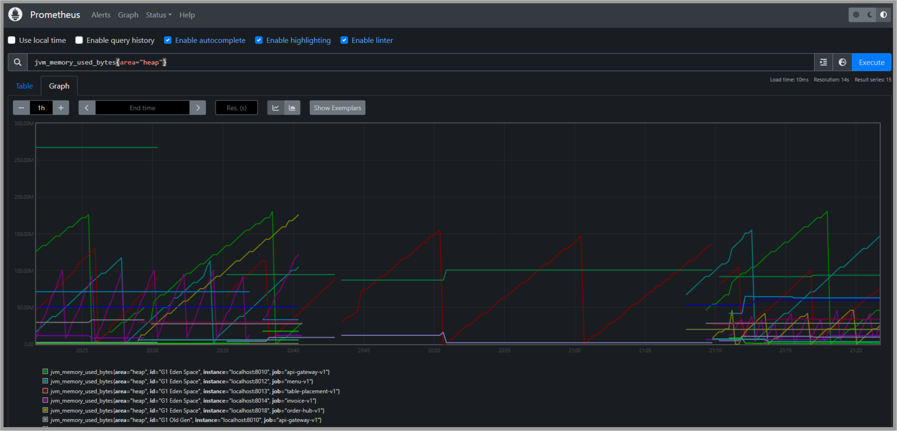

# PROMETHEUS

[← Regresar a notas](../../README.md)  

----

## 1. Instalación
- [Descargar](https://prometheus.io/download/) para `Windows`
- **Ruta sugerida**: `C:\dev-environment\prometheus\prometheus-2.51.1`

> - Configurar el archivo [prometheus.yml](./prometheus.yml) con los servicios que desea monitorear
> - Ejecutar `prometheus.exe`
> - Puerto de escucha: `9090`

---

## 2. Endpoints de Actuator
Accediendo a la opción `Targets` podemos visualizar los servicios que tienen un enpoint activo de Actuator.

---

## 3. Consultas PromQL
Desde el home de Prometheus podemos hacer consultas con PromQL. Por ejemplo:
- `jvm_memory_used_bytes{area="heap"}`: Cantidad de memoria usada por la JVM en la región heap
- `system_cpu_usage`: Porcentaje de uso del CPU
- `http_server_requests_seconds_count`: Total de solicitudes HTTP recibidas por el servidor
- `http_server_requests_seconds_count{uri="/poc/business/menu/v1/menu-options/{productCode}"}`: Total de solicitudes HTTP para una URI específica

