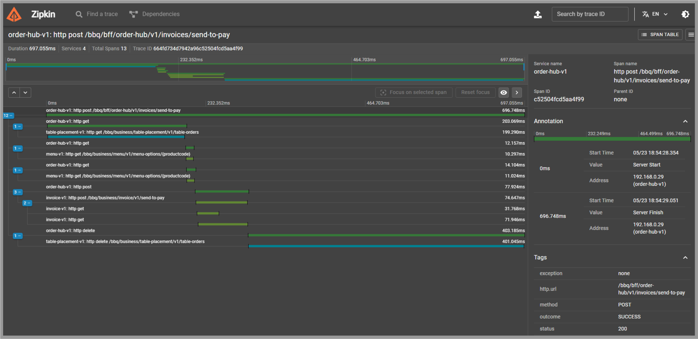
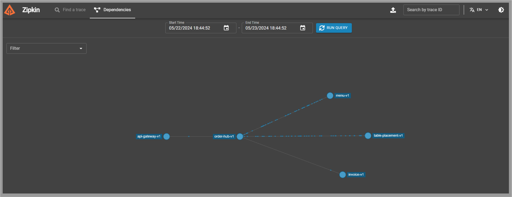

# ZIPKIN

[← Regresar a notas](../../README.md)  

----

## 1. Instalación
- [Descargar](https://zipkin.io/pages/quickstart) para `Java` (latest release)
- **Ruta sugerida**: `C:\dev-environment\zipkin`

> - Ejecutar `java -jar zipkin-server-3.3.0-exec.jar`
> - Puerto de escucha: `9411`

---

## 2. Trazabilidad
Podemos rastrear la trazabilidad de nuestras peticiones desde el tab `Find a trace`.

Con el botón `SHOW` podemos ver el detalle.

---

## 3. Dependencias
Podemos ver el flujo de nuestras peticiones accediendo al tab `Dependencies`.

