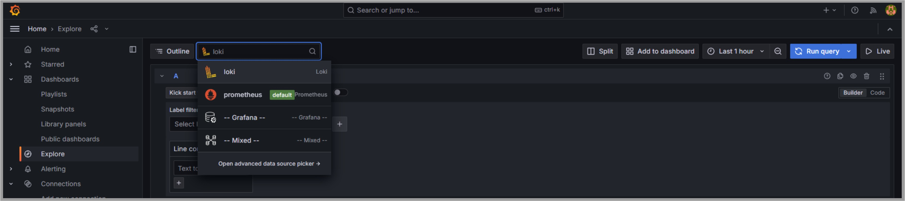

# GRAFANA

[← Regresar a notas](../../README.md)  

----

## 1. Instalación
- [Descargar](https://grafana.com/grafana/download?platform=windows) para `Windows`
- **Ruta sugerida**: `C:\dev-environment\grafana\grafana-v10.4.2`

> - Ejecutar `\bin\grafana-server.exe`
> - Puerto de escucha: `3000`

---

## 2. Fuentes de datos
En la sección `Data sources` podemos administrar nuestras fuentes de datos (Prometheus y Loki)

En la sección `Explore` podemos explorar los datos asociados a cada fuente de información

---

## 3. Logs con LOKI
Podemos filtrar los logs por las etiquetas o labels expuestas a Loki.

Para observar el detalle de cada log, podemos dar clic en el botón `Inspect value`

---

## 4. Métricas con PROMETHEUS
ToDo

---

## 5. Dashboards
- Grafana tiene una variedad de plantillas de dashboards en su página oficial https://grafana.com/grafana/dashboards/
- Podemos buscar el dashboard que más se adecúe a nuestras necesidades e importarlo mediante su ID.
  - `Spring Boot Statistics` (Requiere Prometheus): `6756` 
  - `Spring Boot Observability` (Requiere Loki y Prometheus): `17175`
- Previo a la importación, validar que nuestra integración cumpla con los requisitos del dashboard.

Tras la importación del dashboard, podremos visualizarlo y personalizarlo según nuestras preferencias.

